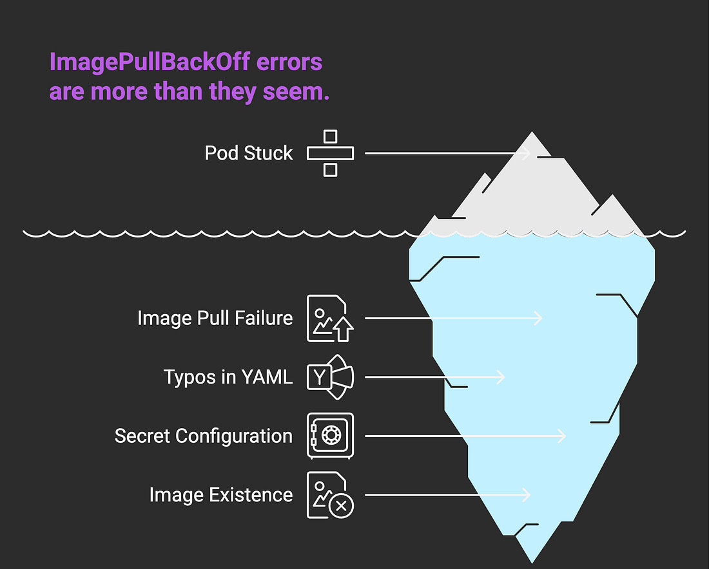
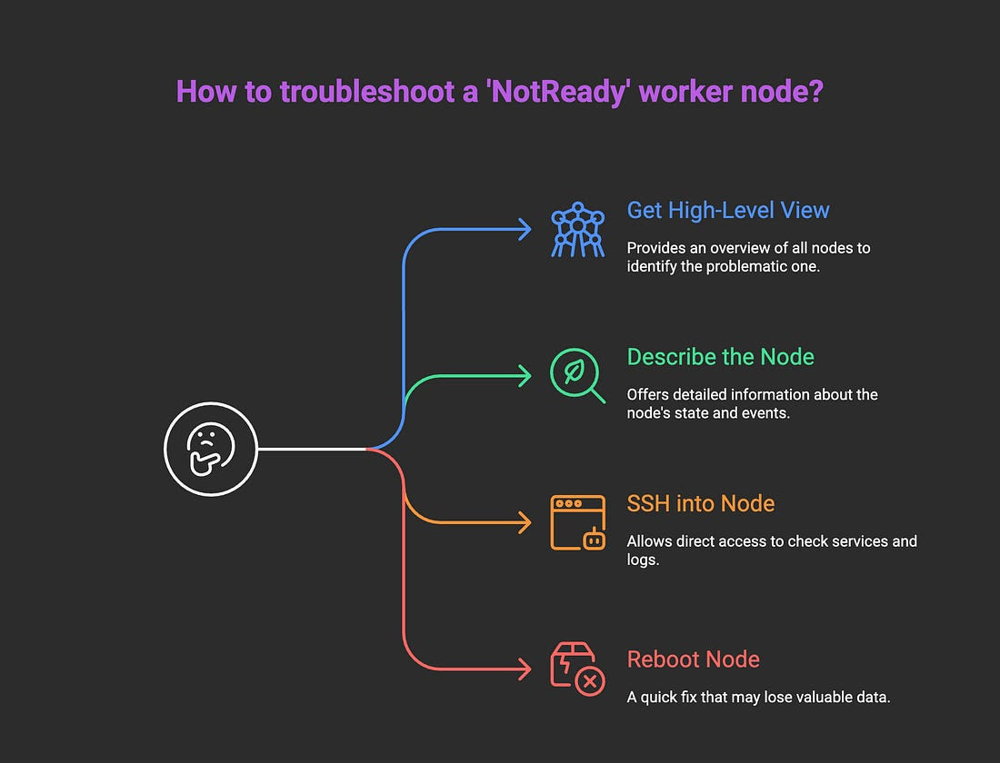
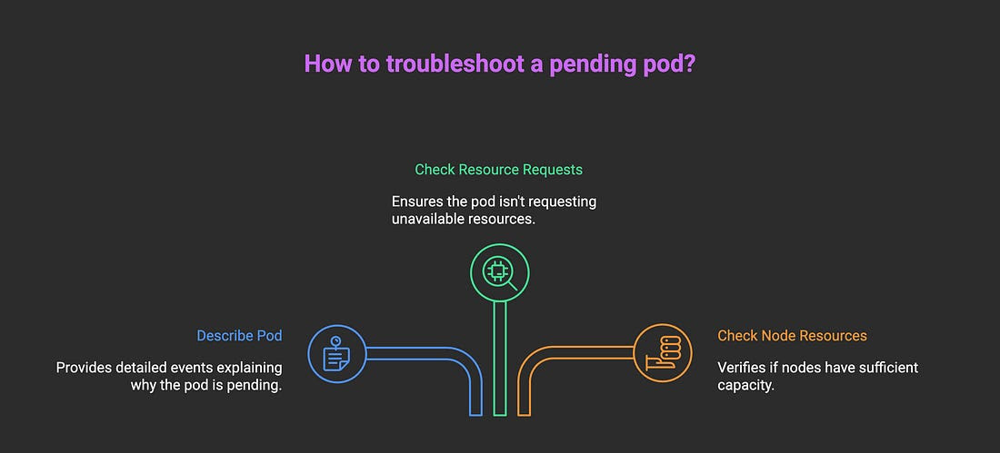
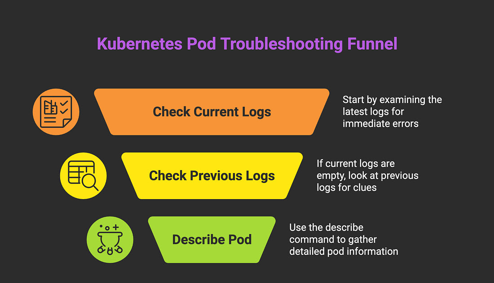
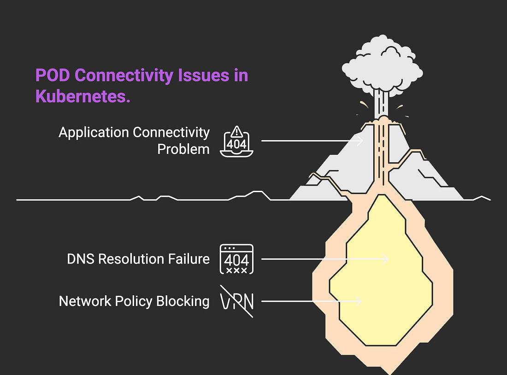

My Simple Kubernetes Fix-It Cheat Sheet
========================================
Let me tell you about a feeling every engineer knows: you type Kubectl get pods, hit enter, and your heart sinks. Instead of a beautiful wall of Running, you see it… ***CrashLoopBackOff***, ***Pending***, ***ImagePullBackOff***.

This is my step by step guide to debugging the five errors I see most often.

 ## 1.___The Annoying ImagePullBackOff___

***The Feeling***: You're trying to deploy a new version of your app, but the pod is stuck. This error feels simple, but it can be surprisingly frustrating.

***What's Actually Happening***: The kubelet on the node is trying to pull the container image you specified, but it's failing.

### My Troubleshooting Steps:

  1. ***Describe the Pod (You see a pattern here, right?)***: The events will give you the exact reason for the failure.

<pre>kubectl describe pod [pod-name]</pre>
Look for the error message. It's usually very clear: image not found, permission denied, or invalid tag.

  2. ***Check for Typos***: Is the image name or tag spelled correctly in your deployment YAML? This is the cause 90% of the time.

  3. ***Check Your Secrets***: If you're pulling from a private registry (like Docker Hub private repos, ECR, GCR), did you create the imagePullSecrets and attach them to your service account or pod correctly?

***Common Mistake***: Assuming the image exists. Always double-check the image repository to confirm the tag you're trying to pull is there.

## 2.___NodeNotReady___

***The Feeling***: You check your cluster, and one of your worker nodes is NotReady. The pods on that node are now in a zombie state.

***What's Actually Happening***: The control plane can't communicate with kubelet one of your worker nodes. The node is either down, overloaded, or has a network issue.

### My Troubleshooting Steps:

  1. ***Get a High-Level View***: See the status of all your nodes.

<pre>kubectl get nodes</pre>

  2. ***Describe the Node***: Just like with pods, describe it gives you the events and conditions that led to the NotReady state. Look for things like memory or disk pressure.

<pre>kubectl describe node [node-name]</pre>

  3. ***The Real Work Begins (SSH)***: This is often an infrastructure problem. You'll likely need to SSH into the broken node to check the status of the kubelet and containerd (or Docker) services.

<pre>sudo systemctl status kubelet
sudo journalctl -u kubelet -f</pre>

***Common Mistake***: Immediately rebooting the node. While it sometimes works (the classic "turn it off and on again" method), you lose all the valuable data needed to identify the root cause.

## 3.___The Mysterious Pending Pod___

***The Feeling***: Your pod is just sitting there... Pending. It’s not running, it’s not crashing, it’s just waiting. Waiting for what?

***What's Actually Happening***: The Kubernetes scheduler has accepted your pod, but it can't find a suitable node to run it on. This is usually a resource problem.

### My Troubleshooting Steps:

  1. ***Describe is Your Best Friend (Again)***: The Events section at the bottom of the describe output is the single most important clue. It will tell you exactly why the pod can't be scheduled.

<pre>kubectl describe pod [pod-name]</pre>

  ___Look for messages like 0/5 nodes are available: 5 Insufficient cpu. This tells you the cluster is out of CPU.___

  2. ***Check Your Resource Requests***: Did you ask for too much CPU or memory? Or perhaps a specific resource, such as a GPU, that isn't available? Check your YAML file.

  3. ***Check Node Resources***: See how much capacity your nodes actually have.

<pre>kubectl top nodes</pre>

***Common Mistake***: Deleting and reapplying the pod without reading the events. The scheduler is telling you the problem; you just have to listen.

## 4.___The Infamous CrashLoopBackOff___

***The Feeling***: the classic. Your pod is trying its best, but it keeps failing. Kubernetes, like a tired parent, sees it crash, tells it to "go try again," and the cycle repeats.

***What's Actually Happening***: In simple terms, your container is starting up, immediately crashing for some reason, and Kubernetes is stuck in a loop of trying to restart it.

### My Troubleshooting Steps:

  1. ***Check the Logs (The Obvious First Step)***: The pod is crashing for a reason, and it’s almost always in the application logs.

<pre>kubectl logs [pod-name]</pre>

  2. ***Check the Previous Logs (The Pro Move)***: Sometimes, the container crashes so fast that kubectl logs it shows nothing. The real gold is in the logs of the previously failed container.

<pre>kubectl logs [pod-name] --previous</pre>

  3. ***Describe the Pod***: This is your best friend for getting more context, like exit codes, restart counts, and other events.

<pre>kubectl describe pod [pod-name]</pre>

***Common Mistake***: Only checking the current logs. The --previous flag is your secret weapon.

## 5.___My Pod Can't Talk to Anything___

***The Feeling***: Your pod is Running, but your application can't connect to the database, another microservice, or the outside world.

***What's Actually Happening***: This is a broad one, but it's usually a DNS issue or a Network Policy blocking traffic.

### My Troubleshooting Steps:

  1. ***Get a Shell***: The first step is to get inside the pod and see the world from its perspective.

<pre>kubectl exec -it [pod-name] -- /bin/sh</pre>

  2. ***Test DNS***: Can your pod resolve the service name? nslookup is your best friend here If it can't find the service, you have a DNS problem.

<pre># Inside the pod
nslookup [service-name]</pre>

  3. ***Test Connectivity***: If DNS works, try to connect directly. curl or wget are great for testing HTTP services.

<pre># Inside the pod
curl -v http://[service-name]:[port]</pre>

***Common Mistake***: Forgetting that Kubernetes services are an abstraction. Always test DNS resolution first before assuming a bigger network problem.

